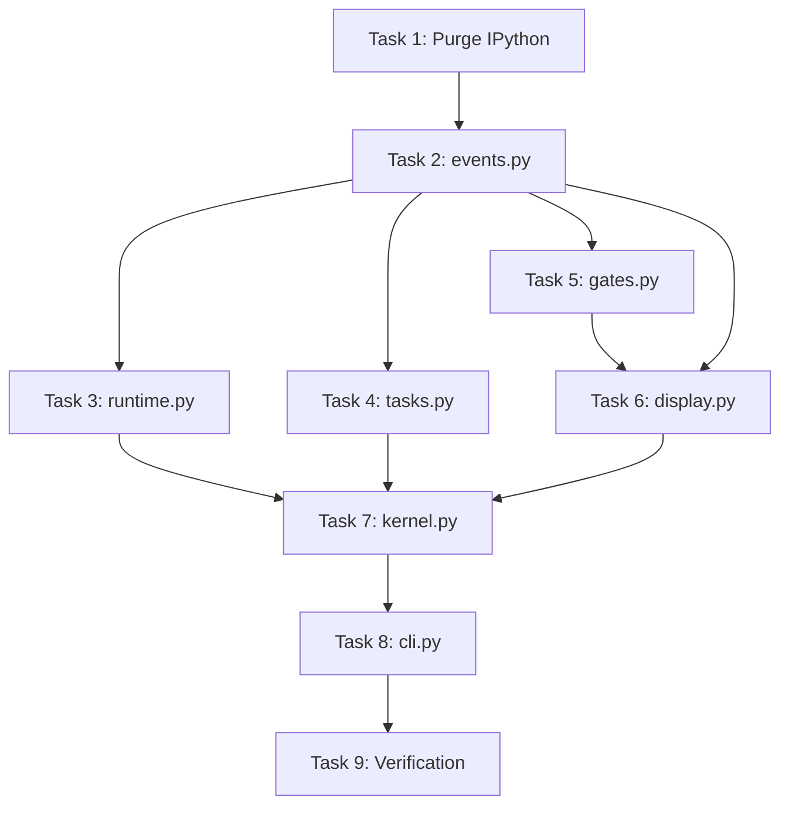

# Implementation Tasks: LLM REPL

**Status:** Complete (all tasks done)
**Spec:** [requirements.md](./requirements.md) | [design.md](./design.md)
**Mode:** Atomic — expect broken intermediate state across tasks 1-8; one verification at task 9.

## Local Resources

| Resource | Path | Used In |
|----------|------|---------|
| pyrepl-channel prototype | `/home/fredrik/Projects/projects-winter-25/research/pyrepl-channel/bootstrap.py` | **Task 3** — lines 107-142 are the compile+eval path to port verbatim |
| Current `repld` source | `/home/fredrik/Projects/projects-spring-26-v2/repld/src/repld/` | Reference for what's being replaced |
| Existing smoketest | `/home/fredrik/Projects/projects-spring-26-v2/repld/tests/smoketest.py` | **Task 8, 9** — expected to pass unchanged except flag rename |

## Task Breakdown

### Task 1: Purge IPython, restructure deps ✓ DONE
**Description:** Remove IPython as a dependency. Add optional `[pretty]` extra for `rich`. Uninstall IPython locally so the refactor can't accidentally import it.

**Files:**
- `pyproject.toml` — drop `ipython` from `dependencies`; add `[project.optional-dependencies] pretty = ["rich>=15"]`
- `.venv` — `uv sync` after editing

**How completed:** `uv remove ipython` then `uv add --optional pretty rich`. Resulted in `dependencies = []` and `[project.optional-dependencies].pretty = ["rich>=15.0.0"]`.

**Acceptance:**
- [x] `uv sync` completes
- [x] `python -c "import IPython"` fails with ModuleNotFoundError from within `.venv`
- [x] `uv sync --extra pretty` installs rich
- [x] `pyproject.toml` no longer mentions ipython

**Dependencies:** None
**Complexity:** Low

---

### Task 2: Build events.py ✓ DONE
**Description:** Create the event type system and module-level queue.

**Acceptance:**
- [x] All event types importable, all `@dataclass(frozen=True, slots=True)`
- [x] `events.emit(CellStart(...))` works before queue init (buffers in _pre_init_buf, flushed on init_event_queue())
- [x] Non-blocking put with drop-oldest on full

**Dependencies:** Task 1
**Complexity:** Low

---

### Task 3: Build runtime.py (compile + eval) ✓ DONE
**Description:** Port the prototype's top-level-await-aware compile+eval into a clean module.

**Explore First:**
- Re-read `/home/fredrik/Projects/projects-winter-25/research/pyrepl-channel/bootstrap.py:107-142` for the `PyCF_ALLOW_TOP_LEVEL_AWAIT` flow.
- Note: the prototype compiles with `"exec"` mode only. We want to also try `"eval"` mode first for single-expression cells, to enable last-expr repr without calling `ast.parse` twice.

**Files:**
- `src/repld/runtime.py` (new) — `compile_cell(src, task_id) -> (code, is_expr)` (tries eval mode first, falls back to exec); `run_cell_on_loop(task_id, src, ns)` async function: compiles, evals, awaits if coroutine, for expression cells prints `repr(value)` via `print(repr(value))` (which flows through `_Tee` → event queue).

**Acceptance:**
- [x] `await asyncio.sleep(0)` at top level works
- [x] `1 + 1` produces `2` on stdout (last-expr repr)
- [x] `print(1 + 1)` produces `2` (normal print path)
- [x] `asyncio.create_task(...)` inside user code works
- [x] Tracebacks propagate to stderr via `traceback.format_exc()`

**Dependencies:** Task 2
**Complexity:** Medium

---

### Task 4: Rewrite tasks.py ✓ DONE
**Description:** `_Tee.write` no longer writes to `self.real` — it emits `StdoutChunk` / `StderrChunk` events instead. `_Tee` still appends to `task["buf"]` (for sync exec response + spill). Delete the `_tee_stdout`/`_tee_stderr` module-level refs (the sys.stdout swap hack is dead code in the new architecture).

**Files:**
- `src/repld/tasks.py` — rewrite `_Tee.write` per design §Method Signatures. Drop `install_tee()`'s stash of `_tee_stdout/_tee_stderr`. Keep `new_task`, `snapshot`, `mark_nudged`, `finalize`, `INLINE_CAP`, spill logic.

**Acceptance:**
- [x] `_Tee` writes don't reach the tty directly (only via event queue)
- [x] `task["buf"]` still captures output for sync exec
- [x] Spill still triggers at INLINE_CAP
- [x] `_current_task` ContextVar still drives attribution
- [x] No references to `_tee_stdout` or `_tee_stderr` remain anywhere in the tree

**Dependencies:** Task 2
**Complexity:** Low

---

### Task 5: Build gates.py ✓ DONE
**Description:** Human-gate primitives (`ask`, `confirm`, `choose`) + gate registry + `resolve_gate`. Futures-based, with timeout + default support per requirements.

**Files:**
- `src/repld/gates.py` (new) — per design §Method Signatures. Emits `HumanPromptOpen` + a sister `ChannelPush` with `kind="awaiting_human"` meta. Stores futures in a registry; `resolve_gate(gate_id, value)` sets the result.

**Acceptance:**
- [x] `confirm("ok?", default=False, timeout=1)` returns `False` after 1s with no response (with default)
- [x] `confirm("ok?", timeout=0.5)` raises `TimeoutError` after 0.5s (no default)
- [x] `resolve_gate(id, True)` unblocks a waiter and emits `HumanPromptResponse`
- [x] Meta keys in the channel push use underscores only (per MCP constraint — hyphens silently dropped)

**Dependencies:** Task 2
**Complexity:** Medium

---

### Task 6: Build display.py ✓ DONE
**Description:** Main-thread consumer. Pops events, renders to `sys.__stdout__`. Uses `rich.Console` if `rich` importable, else plain ANSI. Spawns a companion stdin reader thread for human gates. Respects an `_awaiting_gate: str | None` state — while set, stdin input is parsed per gate kind and routed to `resolve_gate`; otherwise stdin is ignored (or we could log it — but ignore is cleaner).

**Files:**
- `src/repld/display.py` (new) — `run_display(stop: threading.Event)` blocks on main thread until `stop.set()`. Internally: one thread pops events, another reads stdin. Renders per event type per design §Data Flow.

**Acceptance:**
- [x] With rich: cell headers show as dim panels with syntax-highlighted source
- [x] Without rich: plain ANSI coloring, same information
- [x] Stdout chunks from foreground task are untagged; bg-task chunks are prefixed `[<task_id>] `
- [x] Human gate prompt pauses log, accepts stdin, resumes
- [x] `stop.set()` unblocks `run_display` cleanly

**Dependencies:** Task 2, Task 5
**Complexity:** Medium-High

---

### Task 7: Rewrite kernel.py ✓ DONE
**Description:** Remove every IPython reference. Build the new `run_kernel` per design §Method Signatures: bg-thread asyncio loop, install tee, wire IPC, inject `notify`/`ask`/`confirm`/`choose` into `__main__`, either run the display on the main thread or park on signal.

**Files:**
- `src/repld/kernel.py` — full rewrite. `_run_cell_outer` becomes a thin wrapper that calls `runtime.run_cell_on_loop` inside a ContextVar-setting coroutine and emits `CellStart`/`CellDone` around it.

**Acceptance:**
- [x] No imports from `IPython` anywhere in the package
- [x] `grep -r IPython src/` returns nothing (only comment in kernel.py docstring)
- [x] `grep -r _tee_stdout src/` returns nothing
- [x] `grep -r prompt_toolkit src/` returns nothing
- [x] `grep -r TerminalInteractiveShell src/` returns nothing
- [x] `grep -r run_cell_async src/` returns nothing

**Dependencies:** Tasks 2, 3, 4, 5, 6
**Complexity:** Medium

---

### Task 8: Update cli.py ✓ DONE
**Description:** Rename `--no-interact` to `--no-display` to reflect new semantics (kernel is always non-interactive; the flag controls whether a display thread runs). Keep `--init` and `--socket` as-is.

**Files:**
- `src/repld/cli.py` — rename arg; update `main()` to pass `display=not args.no_display`.
- `tests/smoketest.py` — update every `"--no-interact"` → `"--no-display"`.

**Acceptance:**
- [x] `repld --help` shows `--no-display`, not `--no-interact`
- [x] Smoketest subprocess invocations updated

**Dependencies:** Task 7
**Complexity:** Low

---

### Task 9: Verification ✓ DONE
**Description:** Single end-to-end verification pass. Run the full smoketest. If it doesn't pass, fix. Then manual live test against Claude Code.

**Acceptance:**
- [x] `uv run python tests/smoketest.py --phase 5` passes all checks
- [x] Manual: `uv run repld` renders cell blocks nicely; `uv run repld --no-display` is headless
- [x] Manual: Claude Code integration verified
- [x] Manual: `confirm()` gate verified end-to-end

**Dependencies:** Task 8
**Complexity:** Medium (debugging surface is wide)

---

## Task Dependencies

## Parallel Tracks

After Task 2 (events.py) lands, these can run in parallel:
- Track A: Task 3 (runtime.py)
- Track B: Task 4 (tasks.py)
- Track C: Task 5 → Task 6 (gates.py, then display.py)

All three tracks must complete before Task 7 (kernel.py), which is the integration point.
